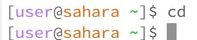
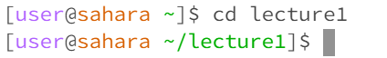
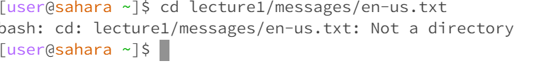
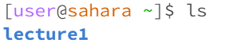
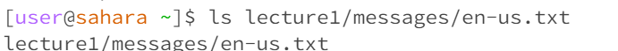
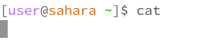
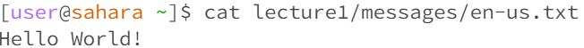
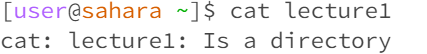

# The function of cd, ls, and cat
**cd no arg**  
In the home directory  
cd is short for change directory, since there is no argument, it does nothing.  
  

**cd path to directory**  
In the home directory  
since cd changes the directory, a path to the directory will change the current directory to the one in the path.  
  

**cd path to file**  
In the home directory  
since cd changes to a directory, a path to a file throws an error "not a directory" as a file is not a directory.  
  

**ls no arg**  
In the home directory  
ls is short for list, so list no argument would just list every file or directory under the current directory.  
  

**ls path to directory**  
In the home directory  
ls with an argument to directory, it just lists everything under that directory, which make sense.  
  

**ls path to file**  
In the home directory  
ls with an argument to file shows the file path itself, as there are no other files or directories under a file.  
  

**cat no argument**  
In the home directory  
cat with no argument shows a blank line, as cat would wait for user input.  
  

**cat path to directory**  
In the home directory  
cat will throw error, as the directory is not a file, and therefore cannot be read.  
  

**cat path to file**  
In the home directory  
cat will read the file and print it in the terminal, as thats the function of cat.  
  

